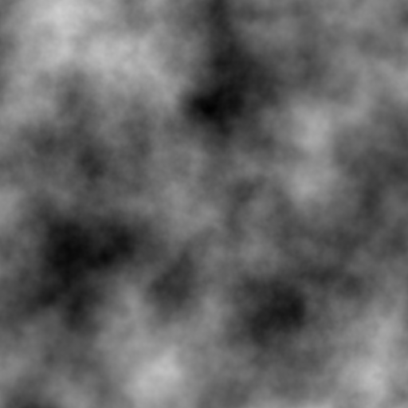

# Noise Generator

> A simple program that generates Simplex noise and saves it as a png file.

> Python was used for this program.

> The output image is set to be 512x512. However, that can be changed in code.

> Change the range in the main for loop to specify how many images you want.

> Here is an example of the output:

>

> NOTE: SOME BLACK SPOTS MIGHT GENERATE IN WHITE AREAS AND VISE VERSA. IF THAT HAPPENS, DISCARD THE SEED AND TRY ANOTHER ONE. FILTERING THE OUTPUT FILES IS RECOMMENDED IF THE FILES ARE GOING TO BE USED AS DATA.

